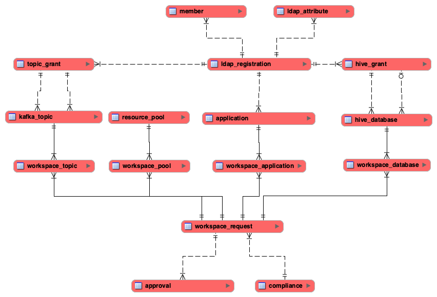

# Heimdali

## Running Locally
*NOTE* Make sure you have `npm` and IntelliJ installed.

### Configuration
In order to run the API locally, you'll need to prepare your development environment.

* Copy `api/src/main/resources/application.local.conf` to `api/src/main/resources/application.conf`
* Copy `api/src/main/resources/runtime.local.conf` to `api/src/main/resources/runtime.conf`
* Update `api/src/main/resources/application.conf` by adding the following lines and specify passwords (you can obtain these passwords by asking in #heimdali-dev):

```
heimdali.cluster.admin.password: ""
heimdali.db.meta.password: ""
heimdali.ldap.provisioningBinding.bindPassword: ""
heimdali.ldap.lookupBinding.bindPassword: ""
heimdali.rest.sslKeyManagerPassword: ""
heimdali.rest.sslStorePassword: ""
heimdali.smtp.pass: ""
```

### Run The App (API-focused development)
* Open the project in IntelliJ
* Open `com.heimdali.Server` and click the green "play" button next to the `object` definition
* The first run won't work, because we need to change the newly created run configuration
* Open the run configuration drop down and click "Edit Configurations..."
* Select the "Server" configuration and enable "Include dependencies with 'Provided' scope"
* Restart the app
* Open the "Terminal" tab
* Run `npm i` which will install the npm dependencies
* Run `npm start` which will spin up the UI

### Run The App (UI-focused development)
* Open the project in VS Code or your preferred editor
* In the terminal tab, run `./sbt compile "api/runMain com.heimdali.Server"`
* In another terminal tab, run `npm i` which will install the npm dependencies
* Run `npm start` which will spin up the UI
* Once the UI has started you can start editing and the UI will refresh based on your changes

## Heimdali API
Heimdali API is the REST interface primally enabling functionality to it's UI counterpart but also a means for automation.

### Code
#### Packages
The code is comprised of a few primary packages:

* REST API -  `com.heimdali.rest`
Responsible for serving requests via HTTP.
* Startup -  `com.heimdali.startup`
Responsible for managing initial (and often repeating) tasks.
* Services -  `com.heimdali.services`
Responsible for providing business logic.
* Clients -  `com.heimdali.clients`
Responsible for interacting with third party integrations like CM API.
* Repositories - `com.heimdali.repositories`
Responsible for managing interactions with the meta database.
* Provisioning - `com.heimdali.provisioning`
Responsible for applying metadata to the cluster and resources requested.
* Models - `com.heimdali.models`
Responsible for representing the domain model of the application.

#### Functional Programming/Cats
Some projects are based on AKKA, Play, Spark (in the case of batch), or some other "pattern library." Heimdali is built on Cats, Cats Effect, Http4s, Circe, and Doobie, all in the [Typelevel](http://typelevel.org) stack. These libraries are all built on Cats and encourage functional programming. If you've never used Cats or done functional programming, the good thing is, most patterns are already established and can just be repeated. All of these libraries have excellent documentation, and even better people in Gitter ready and willing to answer questions (just like us on ##heimdali-dev in Slack).

### Database
The metadata for Heimdali is broken up into two main parts: workspace metadata and application configuration.

#### Workspace Metadata
All workspaces can contain a collection of topics, applications, databases, and resource pools. Depending on the template used, a workspace is stored and when applied, timestamps on the related entity are updated to indicate progress.


#### Configuration


### Contributing
Pull requests are welcome. For major changes, please start the discussion on [#heimdali-dev](https://phdata.slack.com/app_redirect?channel=heimdali-dev).

Please make sure to review [CONTRIBUTING.md](CONTRIBUTING.md)

## Heimdali UI

Heimdali UI is a web application for managing resources.

### What's Being Used?

* [React](http://facebook.github.io/react/) for managing the presentation logic of your application.
* [Redux](http://redux.js.org/) + [Redux-Immutable](https://github.com/gajus/redux-immutable/) + [Reselect](https://github.com/reduxjs/reselect/) for generating and managing your state model.
* [Redux-Saga](https://github.com/redux-saga/redux-saga/) for managing application side effects.
* [Antd](https://ant.design/) for ui elements such as sidebar, dropdown, card, etc.
* [Formik](https://github.com/jaredpalmer/formik/) and [Redux-Form](https://redux-form.com/) for handling forms efficiently.
* [Fuse](http://fusejs.io/) for fuzzy-search feature.
* [React-Csv](https://github.com/react-csv/react-csv/) for exporting data in csv format.
* [Lodash](https://lodash.com/) for using various utility functions.
* [Node](https://nodejs.org) Version 8.x
* [NPM](https://npmjs.com) Version 5.x

### File Structure

#### public/

In this folder is a default `index.html` file for serving up the application. Fonts used by application also reside here.

###### images/

Folder containing image assets used in the application.

#### src/

The client folder houses the client application for your project.  This is where your client-side Javascript components, logical code blocks and image assets live.

###### components/

Here reside the components that are used globally, such as ListCardToggle, Behavior and WorkspaceListItem.

###### containers/

Here we have containers, the components that are connected to redux. Each container has its own actions, reducers, sagas and selectors. Every routes of the app has their relevant containers. The sub-directory names indicate what route they are pointing. Some containers has subfolder named `components` that includes components used for that specific container.

###### models/

Here we define all the models used for the application, including Workspace and Cluster.

###### redux/

Global reducers and sagas of the application stays here.

###### service/

Here resides the code for making api calls.
