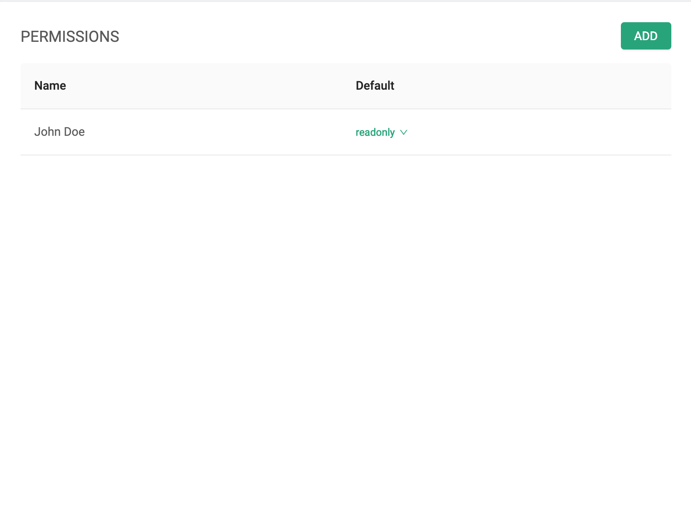
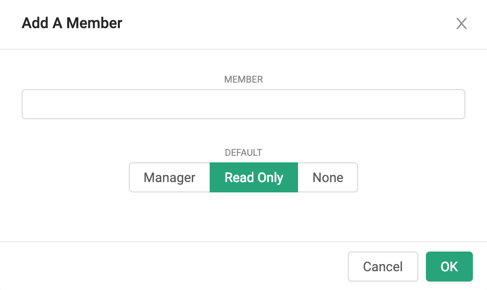

## Member Management
On the right side of the data tab, you'll see the "Permissions" section which allows you to access to the databases in your workspace.

### Add a Member
Clicking the "Add" button will prompt you with a window asking you for basic information about the user/group you're adding to the database.

After typing at least the first few characters of the group or user name you want to add, a list will pop up of existing users and groups to select from.
Once you have made your selection, you can indicate which level of permissions the user should have: 
- **Manager** will grant read, write, and grant permissions to the database (and in Heimdali)
- **Read Only** will grant read only permissions which is ideal for reporting situations
_note_ if the new member has an email address associated, the new member(s) will receive a welcome email with a link to the workspace.
### Change a Member's Role
After locating the existing member in the list, clicking on their current role will present you with other roles to change to.