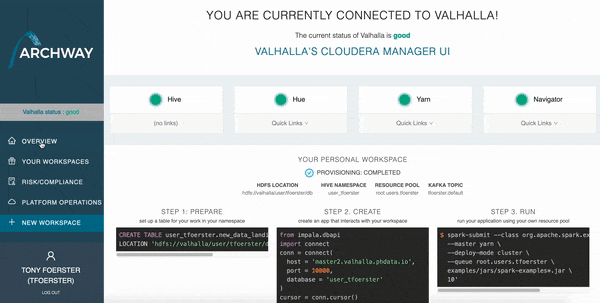

Archway is a self-service application that ensures that your cluster is secure and your users have access to the data they
need so they can do their work efficiently. Archway automates tedious and error prone work that is needed to onboard users onto a cluster and manage changing membership.

Archway takes care of creating Hive databases, Kafka topics, and Yarn resource pools in a structured manner.
It will also centrally manage role based access control throught Sentry, including creating and managing the underlying
LDAP/Active Directory groups needed to enable role based access control.

View the source code on Github <https://github.com/phdata/archway>

Archway is an Apache 2 licensed application.

