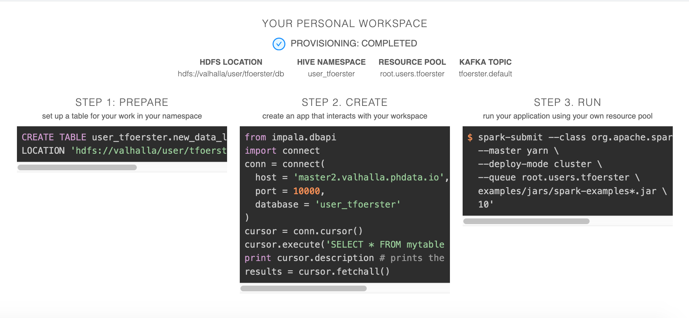
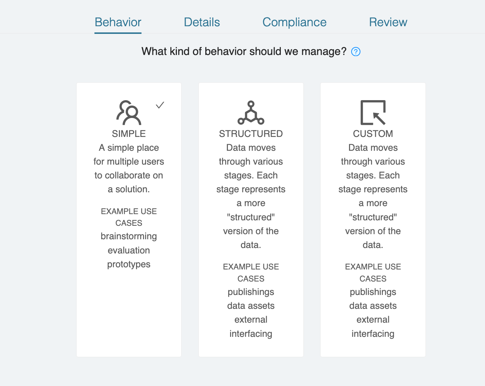
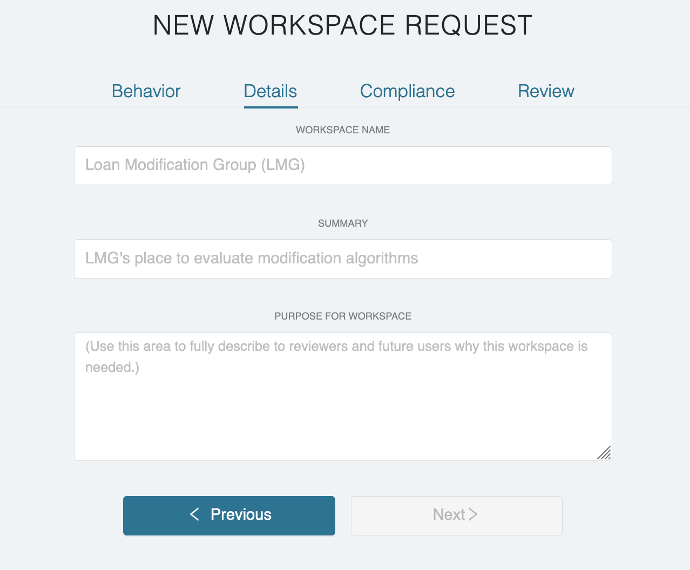
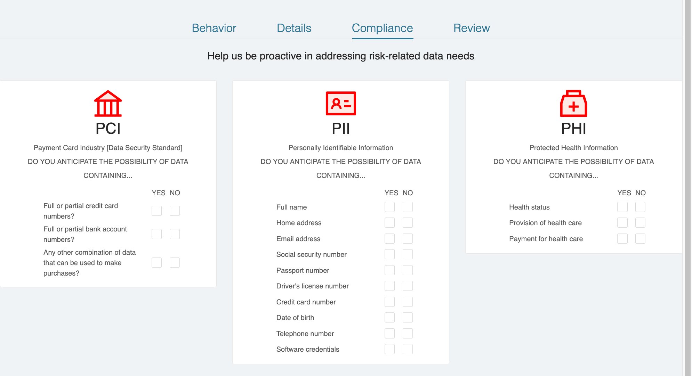
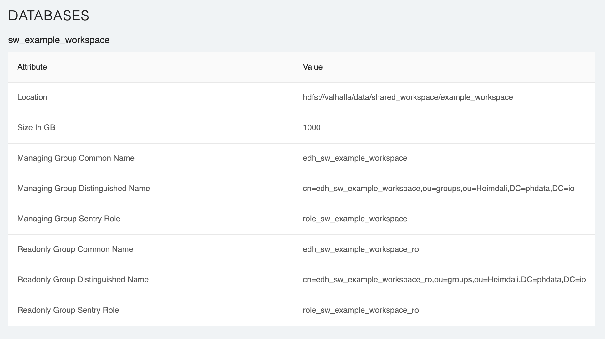

## Workspaces

### Personal Workspaces

Personal workspaces are build in a users home directory. Personal workspaces are for experimentation purposes only, it
is not possible to share data with another user in a personal workspace. The first time a user logs into Archway they
will see a button prompting them to create a personal workspace.

After the workspace is provisioned, details on how to use the workspace will be displayed.

### Workspace Requests

Users request workspaces using the `NEW WORKSPACE` button on the left nav bar

After requesting a workspace, you will go through a wizard to your workspace type

#### Workspace Types

There are 4 basic types of workspaces:

- USER: user workspaces are
- SIMPLE: Simple workspaces contain a single Hive database. They are meant for collaboration between
  team members for proof of concept work or simple applications
- STRUCTURED: Structured databases contain three databases, _raw_, _staging_, and _modeled_ where each
  database contains data in a different state of processing. The _raw_ database is for initial ingestion,
  _staging_ has had some data transformation, and _modeled_ is intended for end-user or application consumption.

#### Workspace Details

Workspace details including the name of the workspace, a short description, and a summary will be requested.
The `WORKSPACE NAME` field will be automatically converted to a Hive/Kafka friendly database or topic name.

#### Compliance

Archway requires a workspace requester to answer some simple questions about the kind of data that will be ingested
into the workspace. These answers can then be used for approval purposes.

#### Request Details

Before you request your workspace you will be able to view the sorts of objects it will create, including Hive Database,
Kafka Topics, and Yarn queues.

### Workspace Approval Process

There are two roles needed to approve a workspace, _risk/compliance_ and _operations_. Risk approvers will approve a workspace
based on the type of data that will be contained in the workspace. Operations will approve a workspace based on the use
case and whether the cluster has capacity and if the workspace is designed correctly for the use case.

Risk and Operations groups are controlled AD groups in the `archway.approvers.risk` and `archway.approvers.infrastructure`
properties respectively.

After a member of both approval groups click the 'approve' button, the workspace will start provisioning in the background.
Provisioning takes anywhere from 3 to 45 minutes.
