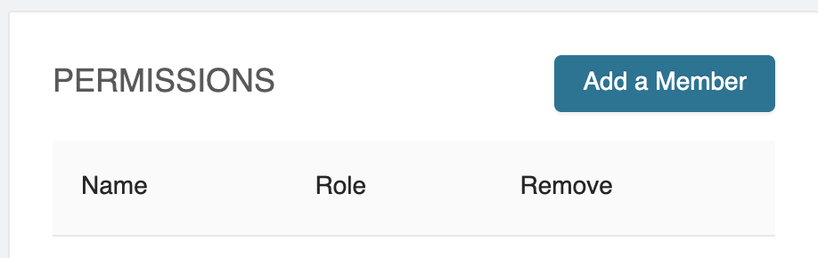

## Workspace Management

Members can be added to a workspace in the `data` tab using the `ADD MEMBER` button

There are three avalilable roles for a database:

- manager: can add other members to the database
- read-only
- read/write

